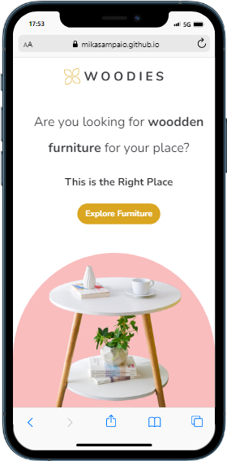

<h1 align="center">WOODIES</h1>

O projeto consiste em uma landing page sobre loja de móveis de madeira, onde o cliente pode visualizar vários tipos de móveis e realizar as compras via online. Além disso, é um projeto previamente responsivo, ou seja, adapta-se tanto para desktops quanto para smartphones e tablets.

<h3>O projeto foi realizado com as ferramentas:</h3>

<ul>
<li>HTML</li>
</ul>

<ul>
<li>CSS</li>
</ul>
 

 

<h3>Link do projeto</h3>
<a href="https://mikasampaio.github.io/WOODIES/">WOODIES</a>
